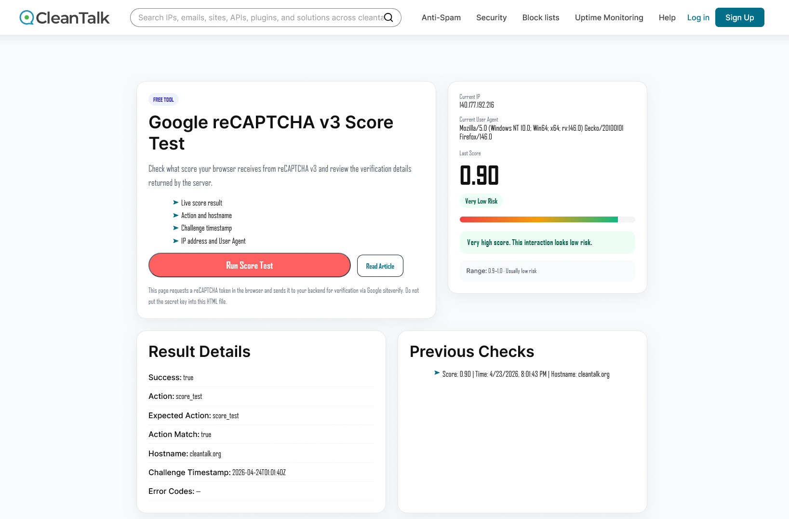
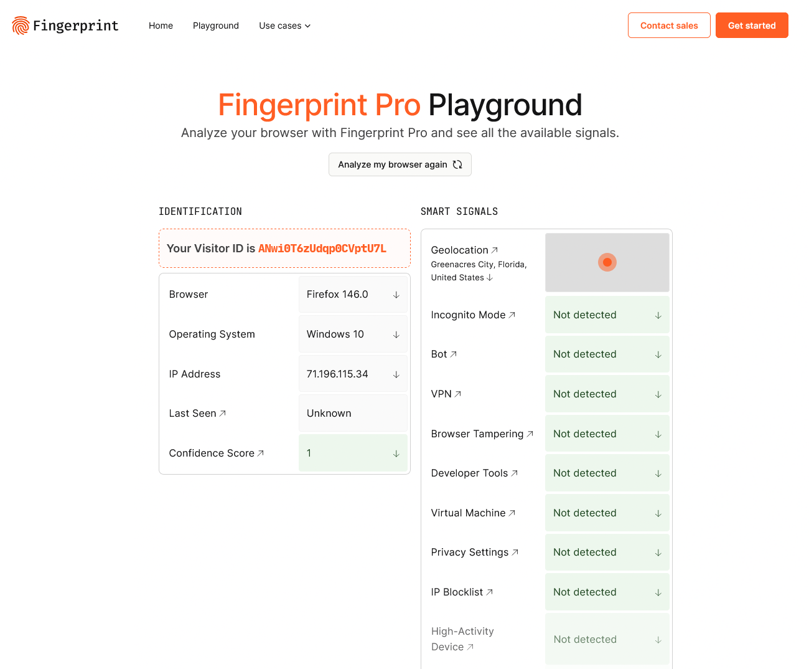
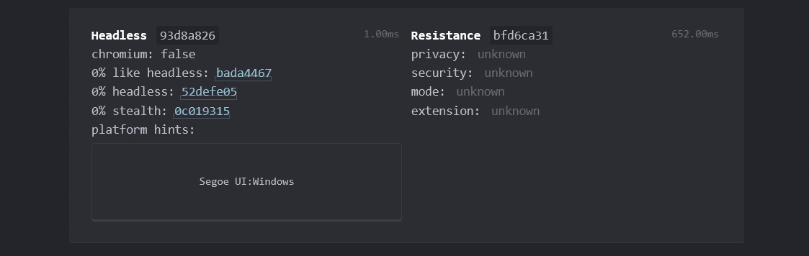
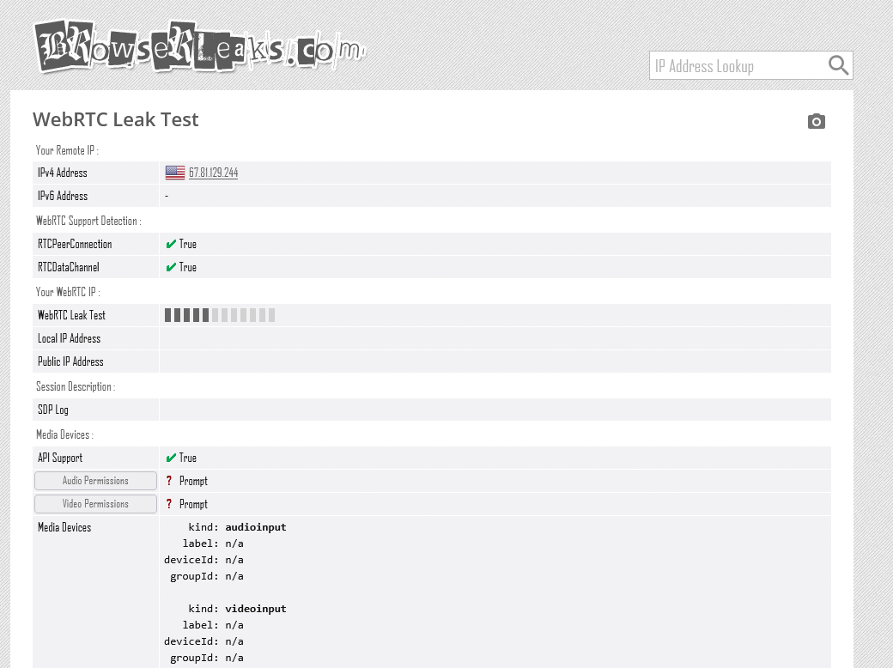
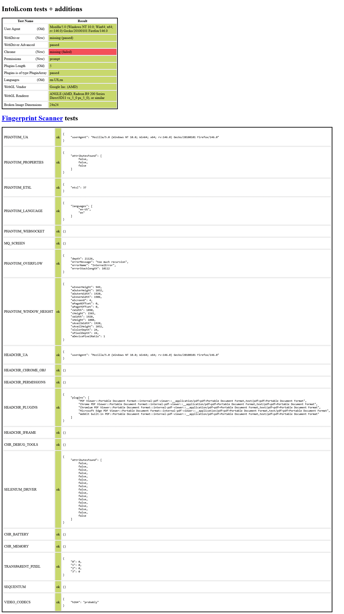

# stealthfox

A patched Firefox that passes the hardest browser-fingerprint detectors in the wild.

**100% Playwright-compatible** — sync and async, all methods, zero API changes. If you already use Playwright, switching is two lines:

```diff
- from playwright.sync_api import sync_playwright
- with sync_playwright() as p:
-     browser = p.firefox.launch()
+ from stealthfox import Stealthfox
+ with Stealthfox() as browser:
```

Every session gets a unique, coherent fingerprint drawn from real-world Firefox telemetry (GPU / audio / fonts / TCP options / ~400 other fields), SOCKS5 proxy auth that actually works, and Bezier-curve mouse motion baked into the browser itself.

**Sync**
```python
from stealthfox import Stealthfox

with Stealthfox(proxy={"server": "socks5://...", "username": "u", "password": "p"}) as browser:
    page = browser.new_page()
    page.goto("https://example.com")
    page.click("#submit")   # mouse arcs to the button on a Bezier curve
```

**Async**
```python
from stealthfox.async_api import Stealthfox

async with Stealthfox(proxy={"server": "socks5://...", "username": "u", "password": "p"}) as browser:
    page = await browser.new_page()
    await page.goto("https://example.com")
    await page.click("#submit")
```

The `browser` object is a `playwright.sync_api.Browser` / `playwright.async_api.Browser` — every Playwright method works as-is.

---

## Results

These are the "best" outcomes observed across independent runs on residential proxies. 

### Google reCAPTCHA v3 — **0.90 / 1.0**

Top-tier score. Google classifies the session as "very likely a human". Most anti-detect stacks plateau around 0.3–0.7.



### Fingerprint Pro — **bot: not detected, VPN: false, tampering: false, dev tools: not detected**

FingerprintJS Pro's full Smart Signals battery flips every flag to "Not detected". Browser correctly identified as Firefox 150 on Windows 10. Confidence score 0.9.



### CreepJS — **0 lies**, fingerprint is internally coherent

No contradictions between headless hints, spoofed values, and real rendering output. That "0 lies" is what kills most anti-detect browsers: one inconsistency (e.g. Chrome UA + Firefox WebGL) and the trust score collapses.



### BrowserLeaks WebRTC — **no public IP leak**

WebRTC srflx address is the proxy egress IP; host candidates are private LAN. The real public IP never leaks via STUN, even on pages that configure their own ICE servers. Stock Firefox leaks the real local IP via WebRTC mDNS — stealthfox doesn't.



### bot.sannysoft.com — **all checks pass**

Every row green: WebDriver not present, Chrome-only properties absent, plugin/mime/languages arrays coherent, permissions API correct, iframe/source window checks pass.



---

## Why it's powerful

**Most anti-detect browsers patch Chromium at the JavaScript level** — they override `navigator`, `WebGLRenderingContext.getParameter`, canvas APIs, and so on via injected scripts. This has two fatal problems:

1. **JS patches are detectable.** Anti-bots enumerate native function `.toString()`, check descriptor configurability, compare property enumeration order, watch for prototype mutations. Every patch leaves a fingerprint of its own. CreepJS has an entire battery of "lies detectors" built around this.
2. **Chromium itself is now suspect.** Residential-proxy bot traffic is overwhelmingly Chromium-based, so detectors weight anything Chromium-shaped as risky by default. And the parts that matter (TLS stack, renderer process) are not fully open-source in Chrome proper — forks either inherit all Chromium tells or drift in visible ways.

**stealthfox patches Firefox at the C++ level.** The browser is fully open source, which means every layer — JS engine, graphics pipeline, networking stack, font engine, audio context — is reachable and modifiable at the source. Our patches go straight into the files that implement the corresponding Web APIs (`dom/base/Navigator.cpp`, `dom/canvas/ClientWebGLContext.cpp`, `dom/media/webaudio/AudioContext.cpp`, ...). The spoofed values come back out through the normal Gecko paths — there is no JS shim, no override, no `Object.defineProperty`. **From the page's point of view, the browser is just telling the truth.** Anti-bot lie-detectors have nothing to latch onto.

This is why we also get to spoof layers that **JS patches structurally cannot reach** — the TCP SYN options, the TLS ClientHello, the font-enumeration call the renderer makes before any JS runs. Detectors look there precisely because JS-level cloaking can't hide it.

stealthfox spoofs **all the layers that matter, together, coherently**:

| Layer | What we do | Why it matters |
|-------|-----------|-----------------|
| TCP options | Windows-style SYN (order MNWNNS, wscale 8, no timestamp, TTL 128) | Server-side fingerprinting (Cloudflare, Akamai) looks here first |
| TLS | Real Firefox JA3/JA4 | Kills every "Chrome impersonator" detector |
| Navigator / screen / hardware | ~400 prefs translated from a Bayesian sample | Coherent combinations, not one-off spoofs |
| GPU / WebGL | Windows ANGLE values, real vendor strings, MSAA counts | Hardest layer to fake correctly |
| Canvas & fonts | Pixel-level substitution, system font list match | Canvas hashing + font enumeration are both solved |
| Audio context | Sample rate, latency, channel count spoofed per-profile | AudioContext fingerprints bucket users tightly |
| WebRTC | `proxy_only`, `relay_only`, mDNS obfuscation | Real IP never leaks via STUN |
| SOCKS5 auth | Custom patch in `nsProtocolProxyService.cpp` | Stock Playwright+Firefox can't negotiate it at all |
| Mouse motion | Bezier curves inside the Juggler, ~10 ms per waypoint | Even `page.click(selector)` moves like a human |
| DNS | Routed through SOCKS proxy by default | No DNS leak when using a residential gateway |

Everything is driven by preferences — no hardcoded values in the binary. You change one pref, you change the spoofed value.

---

## How it compares

Commercial anti-detect browsers (Multilogin, GoLogin, AdsPower, Kameleo, Dolphin Anty, Browserbase) ship a patched Chromium and override fingerprints at the JavaScript layer. That's the ceiling — and it's a low one.

| | stealthfox | Multilogin / GoLogin | AdsPower / Dolphin | Browserbase |
|---|---|---|---|---|
| Engine | Firefox (open source) | Chromium fork | Chromium fork | Chromium |
| Patch depth | C++ source | JS overrides | JS overrides | JS overrides |
| `.toString()` clean | ✅ Native Gecko path | ❌ Detectable shims | ❌ Detectable shims | ❌ Detectable shims |
| Canvas / WebGL | ✅ C++ level | ⚠️ JS override | ⚠️ JS override | ⚠️ JS override |
| SOCKS5 auth | ✅ Patched | ⚠️ Varies | ⚠️ Varies | ❌ |
| Self-hosted | ✅ | ❌ SaaS | ❌ SaaS | ❌ Cloud |
| reCAPTCHA v3 score | **0.90** | ~0.3–0.6 | ~0.3–0.5 | ~0.3–0.5 |
| FP Pro — bot detected | ✅ Not detected | ❌ Detected | ❌ Detected | ❌ Detected |
| FP Pro — tampering | ✅ Not detected | ❌ Detected | ❌ Detected | ❌ Detected |
| FP Pro — VPN flag | ✅ false | ❌ true | ❌ true | ❌ true |
| CreepJS lies | ✅ 0 | ❌ multiple | ❌ multiple | ❌ multiple |

---

## Install

```bash
pip install stealthfox
python -m stealthfox fetch      # one-time ~100 MB download, SHA256-verified
```

Supported platforms: **Windows x86_64**, **Linux x86_64**.

---

## Usage

### Random fingerprint per session

```python
from stealthfox import Stealthfox

with Stealthfox() as browser:
    page = browser.new_page()
    page.goto("https://creepjs-api.web.app")
```

Every call samples a new coherent profile. Log the seed to reproduce interesting runs:

```python
sf = Stealthfox()
with sf as browser:
    print("seed =", sf.seed)
    # ...
```

### Reproducible fingerprint

```python
with Stealthfox(seed=42) as browser:
    ...   # same GPU, same canvas hash, same audio context, every run
```

### Proxies

```python
proxy = {
    "server": "socks5://gate.example.com:1080",
    "username": "user",
    "password": "pass",
}
with Stealthfox(proxy=proxy) as browser:
    ...
```

Schemes supported: `socks5`, `socks4`, `http`, `https`. Auth works on all of them (SOCKS5 via patched `nsProtocolProxyService.cpp`, HTTP/HTTPS via Playwright). DNS is routed through the proxy by default, no local leak.

### Pinning specific fingerprint fields

By default everything comes from `seed`. To force specific values while the rest stays seed-derived:

```python
with Stealthfox(
    seed=42,
    pin={
        "gpu.renderer": "ANGLE (NVIDIA, NVIDIA GeForce RTX 4090 Direct3D11)",
        "gpu.vendor":   "Google Inc. (NVIDIA)",
        "screen.width":  2560,
        "screen.height": 1440,
        "hardware.concurrency": 16,
    },
) as browser:
    ...
```

Full list of pinnable keys, how pinning interacts with the Bayesian sampler, and common patterns are in **[docs/pinning.md](docs/pinning.md)**.

### Disabling human-like motion (advanced)

Mouse movement is human-like by default (Bezier trajectory, ~10 ms per waypoint, Gaussian jitter, ease-out). For raw automation speed — tests that don't touch anti-bot systems — pass `humanize=False`:

```python
with Stealthfox(humanize=False) as browser:
    ...  # page.mouse.move teleports, page.click is instant
```

Or shorten the cap: `humanize=0.3` → max 0.3 s per movement instead of 1.5 s.

---

## CLI

```bash
stealthfox fetch          # download the binary if missing
stealthfox path           # print the absolute path to the cached binary
stealthfox version        # wrapper and binary versions
stealthfox clear-cache    # remove all cached binaries
```

## License

MIT — see [LICENSE](LICENSE). The patched Firefox binary is distributed under the MPL-2.0 (Firefox upstream license). The patches themselves are maintained in the [firefox-stealth](https://github.com/P0st3rw-max/firefox-stealth) source repo.
